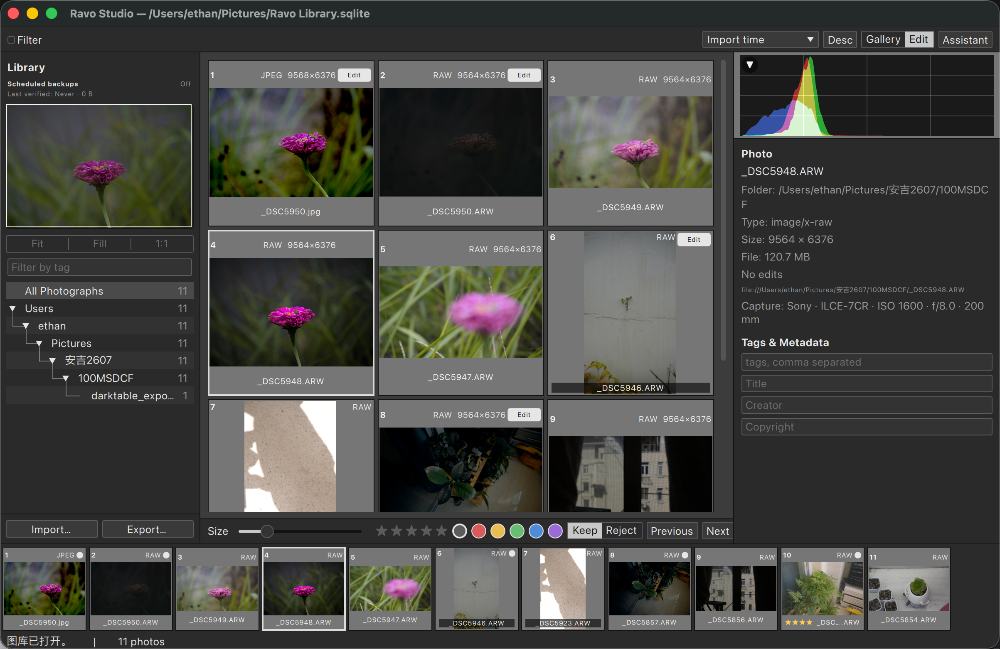
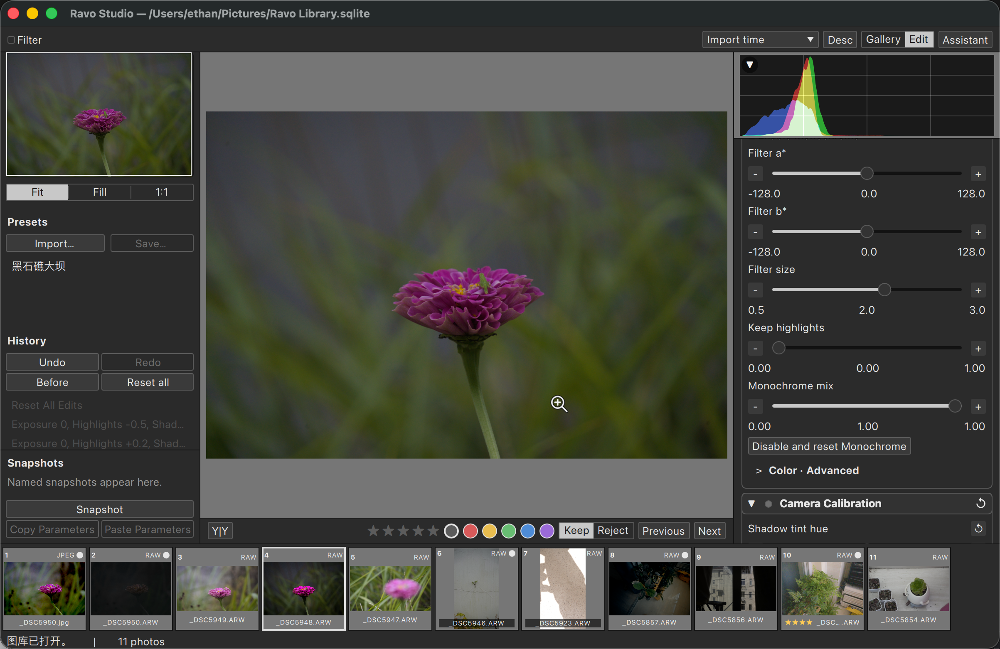

# Ravo — Open-Source RAW Photo Editor, Photo Library Manager, and Color Grading Software

[](https://github.com/NorthBoundWisdom/Ravo/actions/workflows/ci.yml)
[](LICENSE)
[](DevDocs/ARCHITECTURE.md)
[](DevDocs/ARCHITECTURE.md)
[](#install-and-build-from-source)
[](#project-status)

> **Ravo is a free and open-source RAW photo editor, digital-asset / photo
> library manager, and non-destructive color grading application for Windows,
> macOS, and Linux.**

Ravo is a **complete redesign**, not a fork: a from-scratch C++20 and Qt 6
implementation that takes the photo-workflow and image-processing behavior of
**darktable 0.9** as its reference. Frozen static fixtures live in `Ravo/tests/fixtures/frozen`.
Ravo ships its own service layer, catalog, CPU image engine, command-line
client, and Qt Quick desktop application, and it never links, loads, or launches
the old GTK program at runtime.

**Ravo Studio** is the desktop application: photo library, browsing, filtering,
rating and review, non-destructive develop, and export in one local workspace.
The **`ravo` CLI** exposes the same catalog, recipe, render, and export services
for scripting, batch processing, CI, and headless servers.

If you are looking for an **open-source Lightroom or darktable alternative**, a
**RAW converter**, or a **local photo cataloging and color grading tool** that
never touches your originals, Ravo is being built for exactly that workflow.

## Project status

Ravo is **under continuous development and has not reached 1.0**. The core loop
already works end to end — create or open a local library, reference-only
import, browse and review, non-destructive develop, and local export — and
dozens of image operations are implemented against the frozen darktable
reference. Expect gaps, evolving schemas, and platform-specific validation
status. There is no binary release channel yet; build from source.

Ravo is an independent C++20 catalog and Develop product, not a darktable
compatibility project. Remaining photographer-useful work is private-corpus
and three-platform evidence, then the ranked DAM/delivery gaps. Unaccepted
leftover algorithms are leftovers, not ports
([ADR-0106](DevDocs/adr/0106-close-legacy-algorithm-migration.md)). GPU remains
behind CPU goldens. Historic leftover XMP that names an unaccepted leftover
IOP fails closed.

[The Ravo product document](Ravo/README.md), the
[product execution queue](DevDocs/TODO.md), and
[Windows/Linux host evidence](DevDocs/TODO_WINDOWS_LINUX.md) define
the supported scope, validation status, and next work item.

## Screenshots



*Gallery: browse JPEG and RAW photos, then inspect metadata, ratings, tags, and histograms.*



*Edit: inspect a photo and adjust Develop parameters without changing the original.*

## Built for photography

- **Original-safe by default:** reference-only import never copies, moves,
  renames, or rewrites source files during import or editing.
- **A local photo library:** a portable SQLite catalog stores photos, ratings,
  color labels, rejection state, tags, metadata, and editing history. No cloud
  account, no subscription, no telemetry. Catalog-owned recovery mirrors and
  a verifiable CLI backup keep durable edit state separate from rebuildable
  previews and user-owned originals.
- **Focused browsing and culling:** gallery grid and loupe views, filmstrip,
  folder tree, Fit / Fill / 100% zoom, magnifier, filtering and sorting, plus
  histogram, waveform, RGB parade, vectorscope, and split scopes.
- **Non-destructive develop:** edits are versioned recipes with history,
  snapshots, undo/redo, single-image before/after, and a synchronized
  left/right comparison; previews, CLI commands, and exports all run through
  the same CPU image engine.
- **Reusable presets and styles:** `.rstyle.json` schema v1 captures a complete
  recipe, while schema v2 applies an explicitly selected subset without
  resetting unrelated target edits. Lightroom Classic CRS XMP presets and
  strict darktable XMP history can be imported through explicit commands.
- **Predictable export:** single or batch export to JPEG, PNG, TIFF, or an exact
  original copy, with typed format options, metadata privacy modes, and explicit
  output-conflict and cancellation results. Existing files are never silently
  overwritten.
- **Scriptable:** every catalog, recipe, render, and export capability is
  reachable from the `ravo` CLI with machine-readable JSON output. The same
  CLI can discover a running Studio session, read its revisioned selection and
  recipe, commit strict Develop fields, obtain the latest no-replace PNG,
  synchronize catalog recovery mirrors, and create or verify catalog backups.
- **Localized:** Ravo Studio ships English, German, Spanish, French, Brazilian
  Portuguese, Simplified and Traditional Chinese, Japanese, and Korean, driven
  by one C++ command registry with menus, shortcuts, and a command palette
  (`Cmd/Ctrl+Shift+P`).

## Supported file formats

| Direction | Formats |
| --- | --- |
| Import | JPEG, PNG, TIFF, plus BMP / GIF / WebP through Qt image plugins |
| RAW import | LibRaw-decoded RAW such as `.cr2`, `.cr3`, `.nef`, `.arw`, `.dng`, `.raf`, `.orf`, `.rw2` and other recognized suffixes |
| Export | JPEG, PNG (8/16-bit), TIFF (uint8/uint16/float16/float32), or an exact original copy |

Full RAW develop currently supports validated **Bayer 2×2** files through RCD
or PPG and standard **Fujifilm X-Trans 6×6** files through Markesteijn 1/3-pass
on the pinned LibRaw path. Other CFA families and sensor/mode mismatches fail
structurally, though an embedded JPEG may still provide a Gallery thumbnail.
See the
[format coverage matrix](userdoc/docs/en/qa/format-coverage.md) for the exact
boundaries.

## Editing and color grading tools

The CPU engine currently implements Bayer and X-Trans demosaic/RAW denoise,
DNG GainMap and geometric corrections, RAW highlight reconstruction, hot-pixel
and chromatic-aberration correction, profile denoising, lens and perspective
correction, white balance, input/output ICC color management with soft proof,
camera color calibration, color checker fitting, post-demosaic color
reconstruction, RGB primaries, Color Balance RGB, color equalizer and optional
color zones, color harmonizer, color correction and contrast, Velvia,
monochrome, split toning, profile-explicit 3D LUTs, graduated filter, RGB and
tone curves, tone equalizer, guided Texture, D50 Lab sharpening, dark-channel
dehazing, mask-based clone / heal / blur / fill retouch, canvas and output
frame, dither and posterize, and a deterministic text watermark. RAW output
uses the Sigmoid Standard SDR display transform. Masks form a typed graph —
gradient, circle, ellipse, parametric, path, brush, and ordered groups — with a
live Studio overlay.

The engine is **CPU-only today**; GPU acceleration is planned as an independent
adapter behind the correctness and performance gates in
[`DevDocs/GPU_Baseline.md`](DevDocs/GPU_Baseline.md), and the old OpenCL path is
not ported.

## Documentation

Read the [Ravo User Handbook](userdoc/README.md), or visit the
[online documentation](https://northboundwisdom.github.io/Ravo/).

- [Ravo capabilities and CLI reference](Ravo/README.md)
- [Architecture and data lifetimes](DevDocs/ARCHITECTURE.md)
- [Testing and validation strategy](DevDocs/TESTING.md)
- [Migration policy and capability ledger](DevDocs/MIGRATION.md)
- [Product execution queue](DevDocs/TODO.md)
- [Windows and Linux host evidence](DevDocs/TODO_WINDOWS_LINUX.md)
- [Developer documentation index](DevDocs/README.md)

## Install and build from source

There are no prebuilt downloads yet, so Ravo is built from source with CMake
presets. Prepare a workspace for the first time:

```text
git submodule update --init FreeCM
python3 configs/source_root_workflow.py --init
python3 configs/source_root_workflow.py --update
```

Build and launch the macOS Debug configuration:

```text
cmake --preset mac_clang_debug -DBUILD_TESTING=ON
cmake --build --preset mac_clang_debug
./build/mac_clang_debug/Ravo/desktop/ravo_studio.app/Contents/MacOS/ravo_studio
```

Use `win_msvc_debug` / `win_msvc_release` on Windows and `linux_clang_*` on
Linux. [The Ravo developer guide](Ravo/README.md) and
[Packaging](DevDocs/Packaging.md) describe complete build, test, package, and
platform instructions.

## How Ravo relates to darktable

Ravo keeps the photography behavior that darktable 0.9 proved, and drops the
implementation that made it hard to evolve. Production code does not include
old private headers, link old libraries, load old plugins, or configure, build,
or run a leftover GTK application.

What changed: the GTK UI, the dynamic plugin ABI, global mutable state, and the
OpenCL path are replaced by a Qt 6 Quick front end, built-in versioned
operations, explicit ownership and cancellation, and a service layer shared by
the CLI and the desktop app. Ravo does not open a darktable library in place;
historical XMP history is converted through an explicit, strict CLI import that
reports unsupported state instead of silently approximating it.

## Contributing

Issues and pull requests are welcome. Start with
[`AGENTS.md`](AGENTS.md) for repository-wide engineering constraints,
[`Ravo/AGENTS.md`](Ravo/AGENTS.md) for the `Ravo/` subtree, and
[`DevDocs/TODO.md`](DevDocs/TODO.md) for unfinished product execution.
Windows and Linux host evidence lives in
[`DevDocs/TODO_WINDOWS_LINUX.md`](DevDocs/TODO_WINDOWS_LINUX.md) and does not
block other product work. Leftover algorithm ports are closed
([ADR-0106](DevDocs/adr/0106-close-legacy-algorithm-migration.md)).
Behavior changes need matching Ravo unit or contract tests.

## License

Ravo is distributed under the
[GNU General Public License, version 3](LICENSE). Third-party components are
listed in [DevDocs/THIRD_PARTY_NOTICES.md](DevDocs/THIRD_PARTY_NOTICES.md).

---

**Keywords:** open source RAW photo editor, RAW converter, RAW developer, photo
library manager, digital asset management, photo cataloging software, color
grading software, non-destructive photo editing, darktable alternative,
Lightroom alternative, cross-platform photo editor, Windows macOS Linux, C++20,
Qt 6, QML, LibRaw, SQLite catalog, ICC color management, photo culling, batch
export, command-line photo processing.
