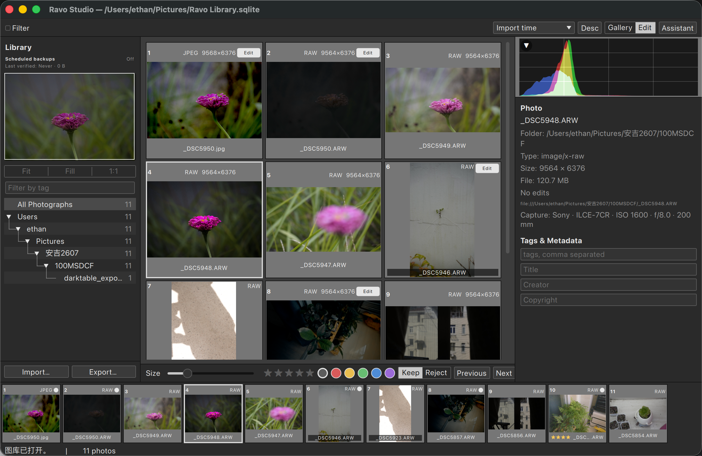
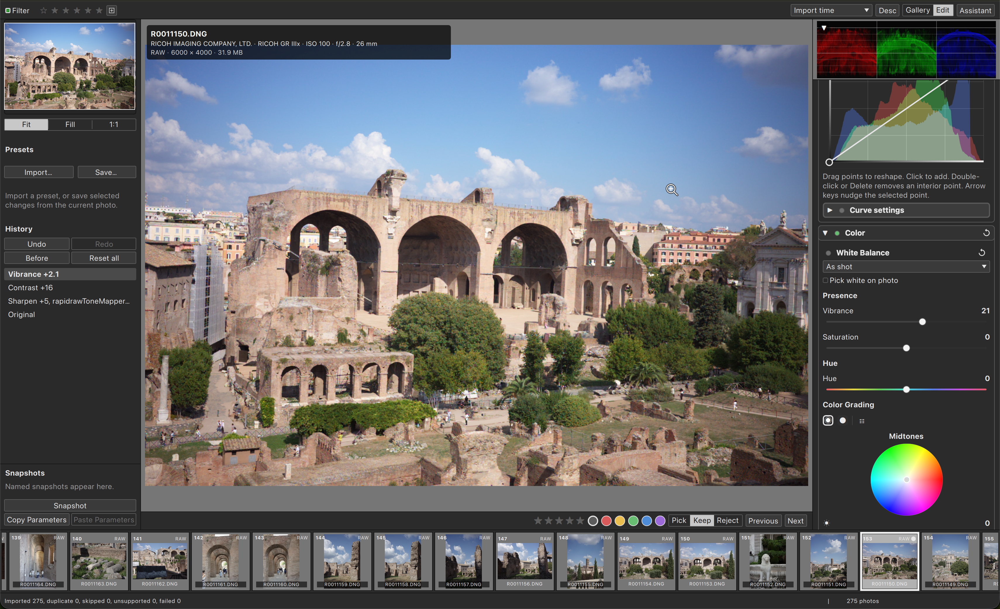

# Ravo Studio

### A home for your photographs, from first import to final export.

[](https://github.com/NorthBoundWisdom/Ravo/actions/workflows/ci.yml)
[](LICENSE)
[](#download)

**Ravo is an open-source photo library and RAW editor for photographers who want
their pictures, their edits, and their workflow close at hand.** Import a shoot,
find the frames worth keeping, shape their colour and light, and export the
finished work from one desktop workspace.

Your library lives on your own storage. Core browsing, editing, and export work
locally without an account. Non-destructive recipes let you revisit a look
without baking it into the original.

**[Download Ravo](https://github.com/NorthBoundWisdom/Ravo/releases/latest) ·
[Read the handbook](https://northboundwisdom.github.io/Ravo/) ·
[Report an issue](https://github.com/NorthBoundWisdom/Ravo/issues)**



*Bring a shoot into view. Browse, compare, rate, and organise it in your own library.*

## From a full card to a finished collection

### Start with an organised shoot

Use **Add** to keep files where they are, or choose **Copy** or **Move** to bring
them into a destination you control. Organise by folder or date, rename with a
template, and make a verified second copy during import. The import workspace
shows filenames early, fills thumbnails in the background, and reports photo
and video counts, size, duplicates, and unavailable items.

Add and Copy preserve the sources. Move removes source files only after the
requested copies verify and the destination is cataloged.

### Find the photographs that matter

Review a Gallery grid or a larger Loupe view. Use ratings, colour labels,
Pick/Reject flags, keywords, folder navigation, and filters to narrow a shoot.
Keep related frames together with stacks, versions, collections, and comparison
views. A filmstrip and navigator help you move through the details.

Supported MOV, MP4, and M4V videos can live alongside your photographs, with
poster frames, duration badges, playback, seeking, volume, and mute. Video
delivery currently preserves the original file; video editing and transcoding
are outside the current workflow.

### Make the image your own

Work from a RAW starting point, then shape exposure, white balance, curves,
colour, contrast, detail, and geometry. Brush, gradient, radial, path, and range
masks let you refine a specific part of the image. Save a look as a preset or
copy selected adjustments across a set.

History, snapshots, undo/redo, and Before/After comparison give you room to
experiment. ICC colour management, soft proofing, histograms, waveform, RGB
parade, and vectorscope support careful finishing.



*Build a look, inspect the result, and return to an earlier decision.*

### Deliver with control

Export individual photographs or a batch as **JPEG, PNG, TIFF, or an exact
original copy**. Choose image size, format options, and metadata privacy.
JPEG can target a maximum file size; supported PNG/TIFF paths retain higher
precision. Existing output files produce an explicit conflict rather than an
unexpected overwrite.

For RAW+JPEG shoots, **Export Companion JPEG** can deliver the camera's JPEG
unchanged. External-editor round trips keep derived files associated with
their source photographs.

### Keep your library recoverable

Your catalog stores the organisation and edit history separately from
rebuildable previews. In **Settings → Catalog & Backup**, choose automatic
backup frequency, destination, and retention; check the last result or run a
backup immediately. Verified backups can be restored into a new catalog.

Catalog backups include catalog state and recovery records, and exclude
original photos/videos and preview caches. Keep a separate backup of your
original media. Automatic backups run while Studio is open.

## Download

Get the available packages from
[GitHub Releases](https://github.com/NorthBoundWisdom/Ravo/releases/latest).

| Your computer | Package |
| --- | --- |
| macOS on Apple silicon | ARM64 DMG |
| macOS on Intel | x86_64 DMG |
| Windows on Intel/AMD | x86_64 ZIP |
| Linux on Intel/AMD | x86_64 AppImage or DEB |
| Linux on ARM64 | aarch64 AppImage or DEB |

Open the matching release notes for installation details and the features in
that build. Linux packages target the documented modern distribution/runtime
baseline; see [installation](userdoc/docs/en/quick-start/install-and-launch.md).

Ravo is in active development before 1.0. **This README describes the current
development branch; a published download can contain an earlier feature set.**
Platform qualification and remaining release work are tracked openly in
[Packaging](DevDocs/Packaging.md) and the [product queue](DevDocs/TODO.md).

## Your first session

1. Create or open a library.
2. Import a folder. Choose Add, Copy, or Move to match your storage plan.
3. Review the shoot in Gallery or Loupe, then open a photograph in Edit.
4. Refine the image, compare the result, and export your selection.
5. Configure catalog backups in Settings.

Studio is available in English, German, Spanish, French, Brazilian Portuguese,
Simplified Chinese, Traditional Chinese, Japanese, and Korean. Language,
workspace panel sizes, catalog backups, and the optional Assistant connection
are grouped in Settings.

[Start the five-minute tour →](userdoc/docs/en/quick-start/five-minute-tour.md)

## Media that fits your workflow

- **RAW:** supported Bayer and Fujifilm X-Trans files decoded through LibRaw.
  Camera, sensor, and recording-mode support depends on the actual file.
- **Photographs:** JPEG, PNG, supported TIFF layouts, BMP, GIF, and WebP.
  Primary HEIC/HEIF photographs use the native provider on macOS 14 or later.
- **Video:** MOV/MP4/M4V with supported H.264, HEVC, or standard ProRes video
  and supported audio or no audio. HLG/PQ preview is mapped to SDR.
- **Finished output:** rendered JPEG, PNG, TIFF, or original-byte copies.
  Videos support original-byte copies.

The [format matrix](userdoc/docs/en/qa/format-coverage.md) explains the precise
boundaries. Unsupported files receive a reason instead of being silently
treated as successfully imported.

## For people who automate

The `ravo` command-line client shares Studio's catalog and image services.
Use JSON results to inspect a library, apply edits, render previews, export
batches, and verify backups. It can also inspect and control a running Studio
session through revision-checked local commands.

```sh
ravo --version --json
ravo operations --json
ravo catalog list --catalog "/path/to/library.sqlite" --json
```

Read the [CLI guide](userdoc/docs/en/guides/cli.md) or the
[capability and command reference](Ravo/README.md).

## Build, contribute, and explore

Ravo uses C++20, Qt 6 Quick, and CMake presets. For a new source checkout:

```sh
git submodule update --init FreeCM
python3 configs/source_root_workflow.py --init
python3 configs/source_root_workflow.py --update
cmake --preset mac_clang_release -DBUILD_TESTING=ON
cmake --build --preset mac_clang_release
```

Use the matching `win_msvc_*` or `linux_clang_*` preset on Windows or Linux.
The [build guide](Ravo/README.md#build-and-test) covers prerequisites, dependency
access, tests, and launch paths. The [developer documentation](DevDocs/README.md)
explains architecture and current work; contribution constraints are in
[AGENTS.md](AGENTS.md).

Ravo draws on darktable's photographic heritage while using its own catalog,
engine services, and Qt Quick application. Historic XMP conversion has explicit
compatibility boundaries; an old GTK application is not part of the runtime.

## Open source

Ravo is licensed under the [GNU AGPL v3](LICENSE). Third-party licences and
attribution are recorded in [the notices](DevDocs/THIRD_PARTY_NOTICES.md).
The optional Assistant sends requests to the endpoint you configure; it is
separate from the local photo-editing workflow.
